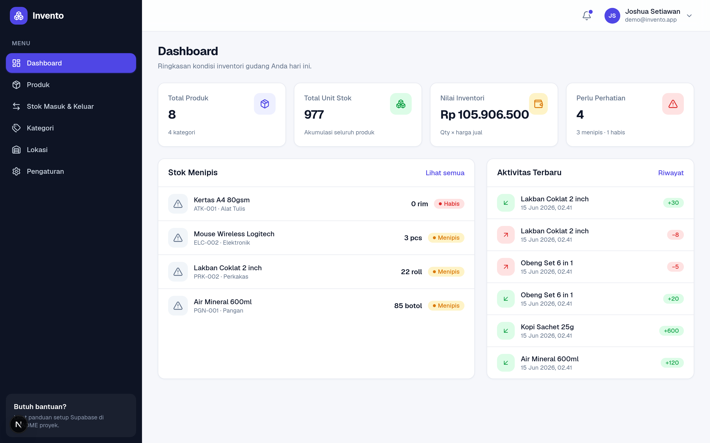
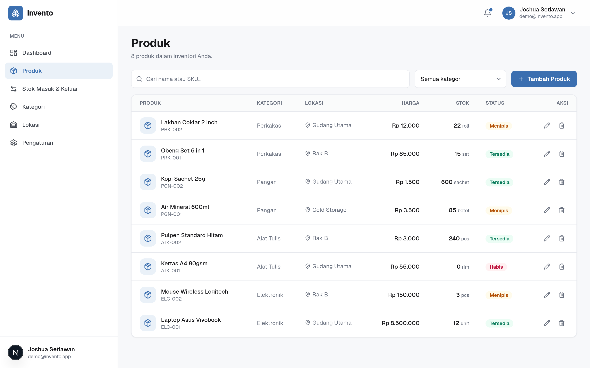
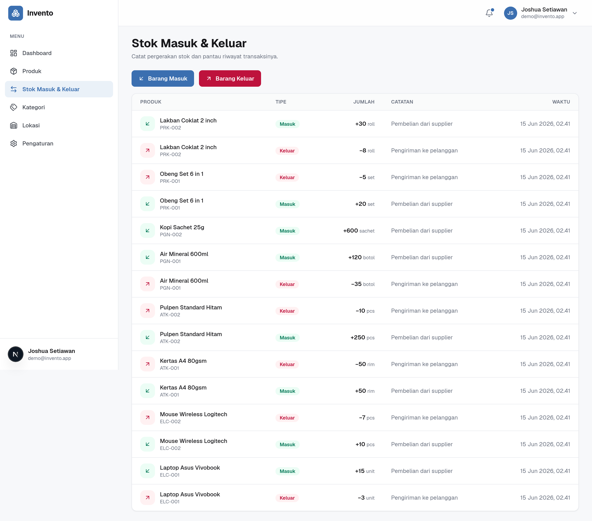
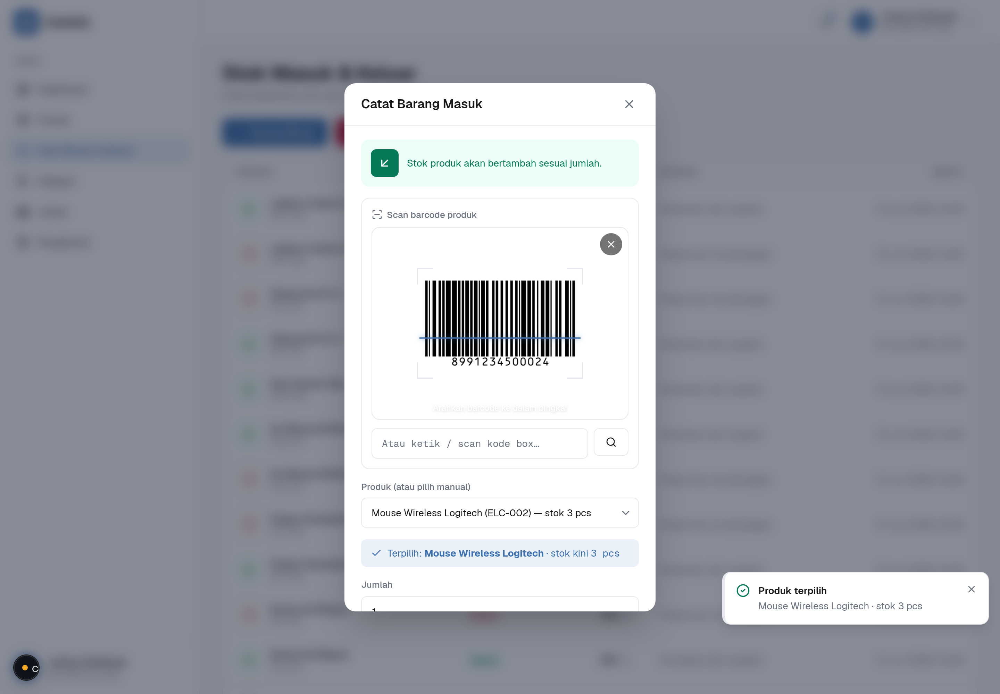
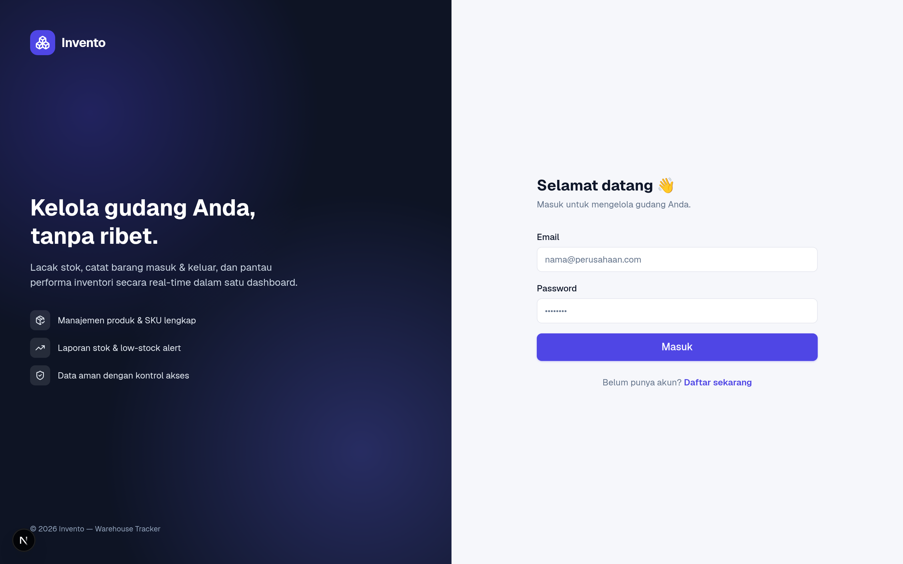
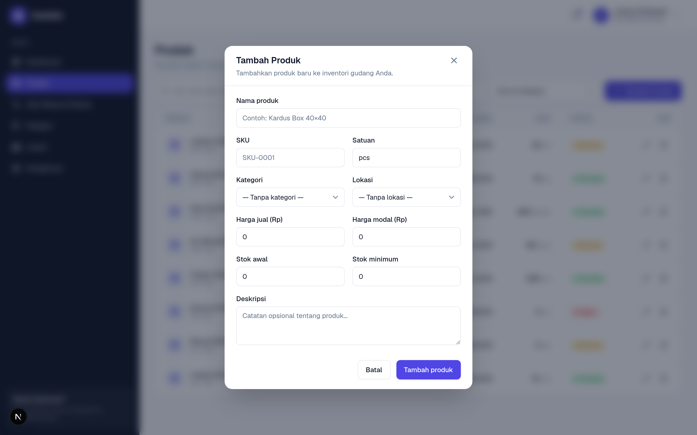
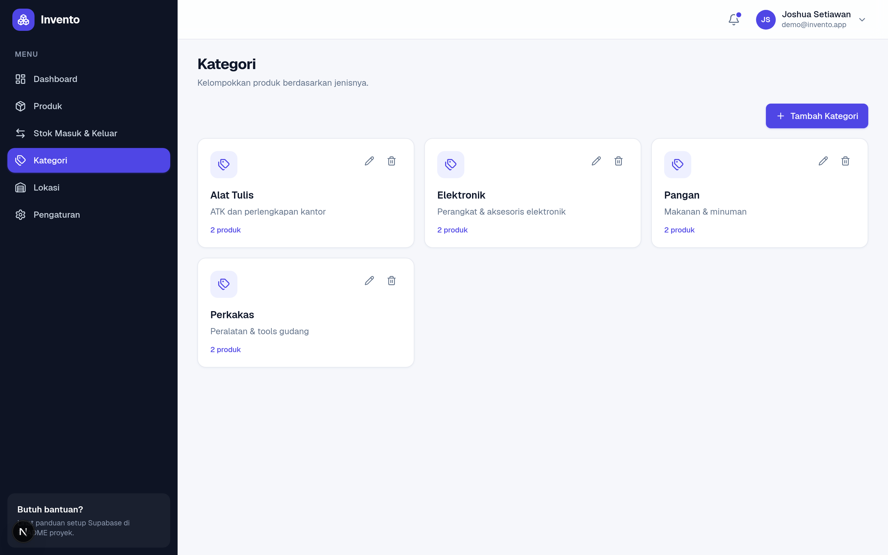
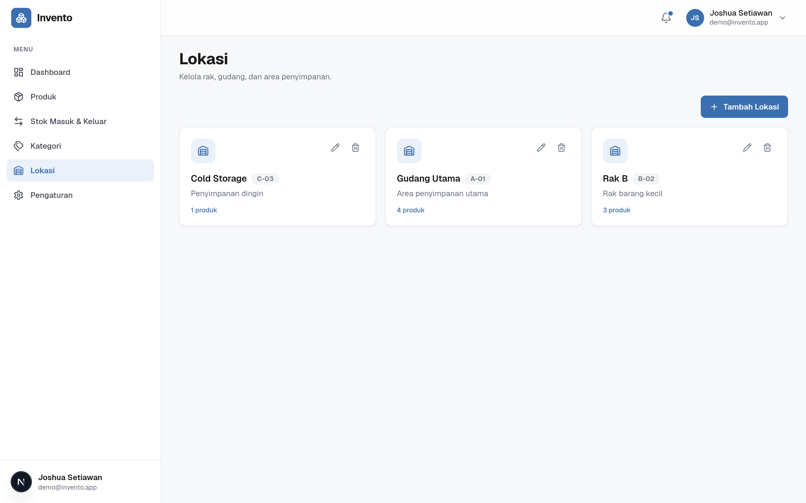

# Invento — Warehouse Tracker

Aplikasi pelacak gudang (inventory management) berbasis **Next.js 16 (App Router)** + **Supabase**. Kelola produk, catat barang masuk & keluar, pantau stok menipis, dan lihat ringkasan di dashboard — dengan UI modern dan skeleton loader di setiap halaman.

UI mengikuti design system **Invento "Tidal"** dari Google Stitch: latar Canvas Mist, satu aksen **Tidal Blue (#3B6FB0)**, tipografi **Geist** + **Geist Mono** (untuk seluruh angka/kode/qty), sidebar terang, border 1px halus, dan badge status bertint.

## 🖼️ Preview

> Screenshot di bawah diambil dari aplikasi yang **benar-benar berjalan** secara lokal (Next.js + Supabase lokal, dengan data demo).

### Dashboard


### Produk


### Stok Masuk & Keluar


### Scan Barcode (Barang Masuk / Keluar)
> Pilih produk dengan **scan barcode** — kamera, scanner gun, atau ketik manual. Kode dibaca lalu dicocokkan ke produk dan terpilih otomatis. Screenshot di bawah menunjukkan kamera benar-benar membaca barcode (diuji headless dengan kamera-palsu).



<table>
  <tr>
    <td width="50%"><b>Login</b><br/></td>
    <td width="50%"><b>Tambah Produk</b><br/></td>
  </tr>
  <tr>
    <td width="50%"><b>Kategori</b><br/></td>
    <td width="50%"><b>Lokasi</b><br/></td>
  </tr>
</table>

## ✨ Fitur

- 🔐 **Autentikasi** — daftar / masuk dengan email & password (Supabase Auth)
- 📦 **Manajemen Produk** — CRUD produk lengkap (SKU, harga, satuan, stok minimum) + pencarian & filter kategori
- 🔄 **Stok Masuk & Keluar** — catat pergerakan stok; stok produk terupdate otomatis (lewat trigger DB) dengan riwayat transaksi
- 📷 **Scan Barcode** — pilih produk saat barang masuk/keluar lewat scan barcode: kamera (HP/webcam), scanner gun (USB/Bluetooth), atau ketik manual. Dicocokkan ke kolom `barcode` produk (fallback ke SKU)
- 🏷️ **Kategori & Lokasi** — kelompokkan produk dan lacak posisi penyimpanannya
- 📊 **Dashboard** — total produk, total unit, nilai inventori, dan low-stock alert
- 💀 **Skeleton Loaders** — loading state di setiap rute (`loading.tsx`)
- 🛡️ **Aman** — Row Level Security (RLS) per pengguna di semua tabel

## 🚀 Setup

### 1. Buat project Supabase
Buat project gratis di [supabase.com/dashboard](https://supabase.com/dashboard).

### 2. Jalankan skema database
Buka **SQL Editor** di dashboard Supabase, lalu jalankan isi file migrasi secara berurutan:

```
supabase/migrations/0001_init.sql
supabase/migrations/0002_products_barcode.sql
```

`0001` membuat tabel `profiles`, `categories`, `locations`, `products`, `stock_movements`, beserta RLS, trigger auto-update stok, dan auto-create profil saat signup. `0002` menambahkan kolom `barcode` pada produk untuk fitur scan.

### 3. Konfigurasi environment
Salin `.env.example` menjadi `.env.local` dan isi dari **Project Settings → API**:

```bash
NEXT_PUBLIC_SUPABASE_URL=https://xxxx.supabase.co
NEXT_PUBLIC_SUPABASE_ANON_KEY=eyJhbGci...
```

### 4. Jalankan
```bash
npm install
npm run dev
```

Buka [http://localhost:3000](http://localhost:3000), daftar akun, dan mulai kelola gudang Anda.

> 💡 Jika `.env.local` belum diisi, aplikasi akan menampilkan panduan setup alih-alih crash.

### 5. (Opsional) Isi data demo
Untuk mengisi produk, kategori, lokasi, dan riwayat stok contoh sekaligus membuat user demo:

```bash
SUPABASE_URL=<url> SERVICE_ROLE_KEY=<service_role_key> node scripts/seed.mjs
```

Login demo: **demo@invento.app** / **demo123456**.

## 🧱 Tech Stack

| | |
|---|---|
| Framework | Next.js 16 (App Router, Server Actions) |
| Bahasa | TypeScript |
| Styling | Tailwind CSS v4 |
| Ikon | lucide-react |
| Backend | Supabase (Postgres, Auth, RLS) |

## 📁 Struktur

```
src/
├─ app/
│  ├─ (auth)/            # login & register
│  └─ (app)/             # dashboard, products, movements, categories, locations, settings
│     └─ */loading.tsx   # skeleton loaders per rute
├─ components/
│  ├─ ui/                # design system (button, card, dialog, skeleton, toast, …)
│  ├─ layout/            # sidebar, topbar, app shell
│  └─ <feature>/         # komponen per fitur
├─ lib/
│  ├─ supabase/          # client / server / middleware
│  ├─ actions/           # Server Actions (CRUD)
│  └─ data.ts            # query functions
└─ types/database.ts     # tipe data
supabase/migrations/     # skema SQL
```

## 📜 Lisensi
MIT
